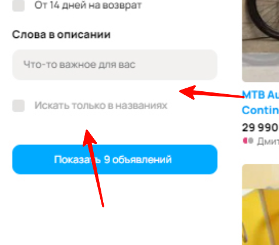
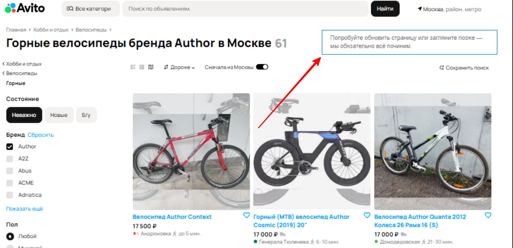
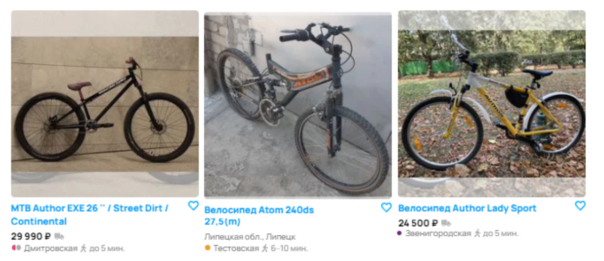
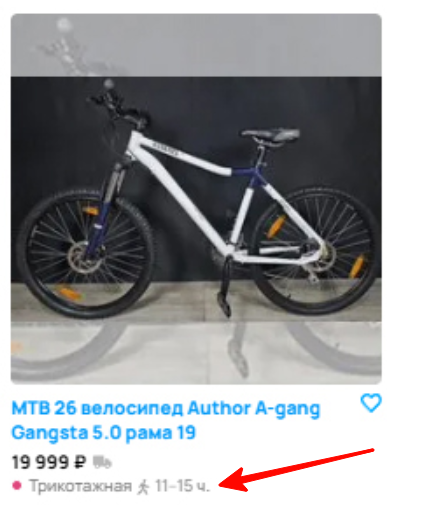
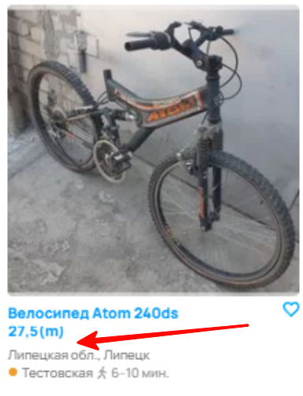
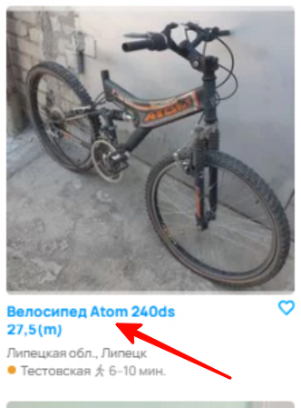
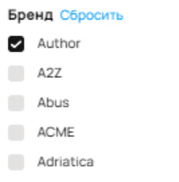
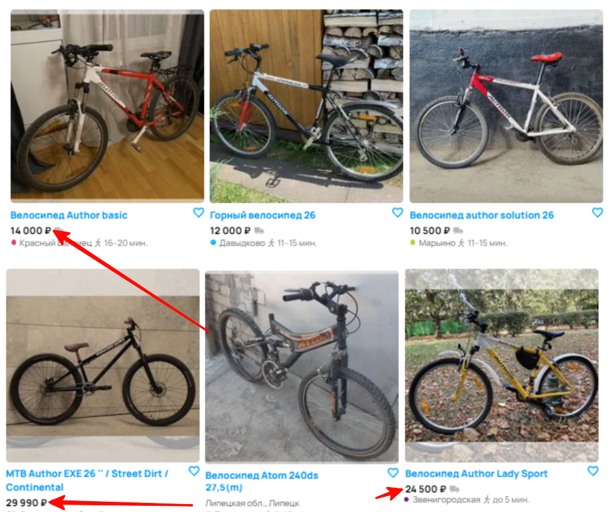
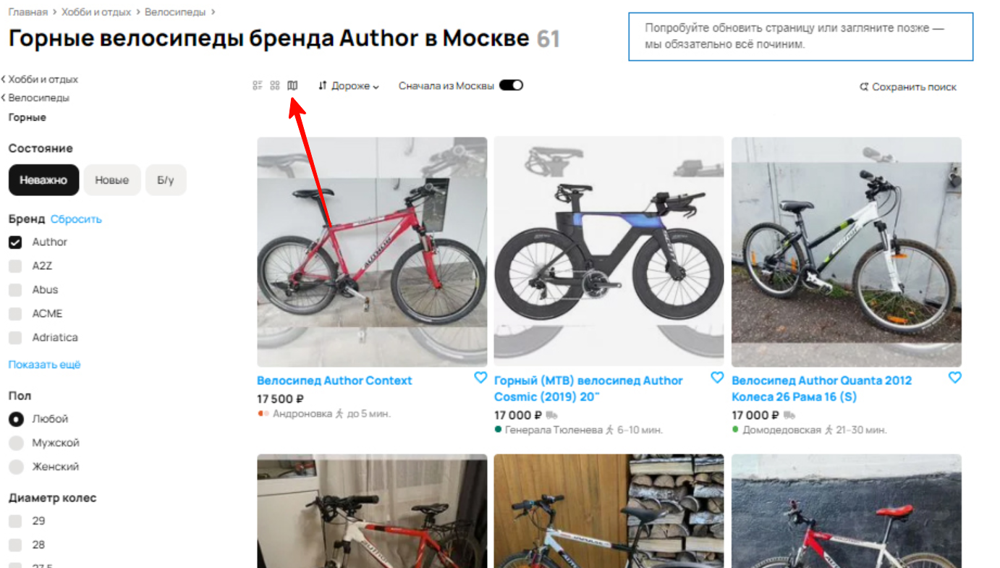
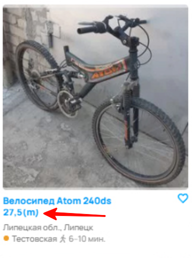

# Задание 1

## Баг 1: Не отображается категория "Горные" над поиском

## Баг 2: Большие отступы у чекбокса "Искать только в названиях"
Уточнить у дизайнера корректность отображения чекбокса.

## Баг 3: Несоответствие счетчика объявлений
Счетчик показывает 61 объявление, но:
- В пагинации более 100 страниц
- В кнопке "Показать X объявлений" указано 9 объявлений

## Баг 4: Некорректное отображение количества объявлений в кнопке "Показать X объявлений"
Счетчик в кнопке показывает 9 объявлений, но:
- В заголовке указано 61 объявление
- В пагинации более 100 страниц

## Баг 5: Некорректное отображение количества страниц
Отображается 100 страниц объявлений, но:
- В заголовке указано 61 объявление
- В кнопке "Показать X объявлений" — 9 объявлений

## Баг 6: Некорректное отображение инфоблока "Попробуйте обновить страницу..."
Блок отображается при наличии загруженных объявлений. Нужно уточнить условия отображения.

## Баг 7: Некорректная работа фильтра "Сначала из Москвы"
Фильтр включен, но среди объявлений есть объявления из г. Липецк.

## Баг 8: Корректность расчета времени до метро
Проверить правильность отображаемого времени до ближайшей станции метро.

## Баг 9: Отсутствует цена в карточке объявления
Цена не отображается в одной из карточек. Нужно проверить корректность загрузки и отображения данных.

## Баг 10: Велосипед Atom отображается при выборе фильтра "Author"
Проблема в модерации или фильтрации объявлений.

## Баг 11: Некорректная работа сортировки "Дороже"
Сортировка не выстраивает объявления в порядке увеличения цены.

## Баг 12: Вид "На карте" не работает
Функция просмотра объявлений на карте не активна.

## Баг 13: Некорректное отображение шрифта в заголовке карточки
Шрифт отображается обрезанным.
